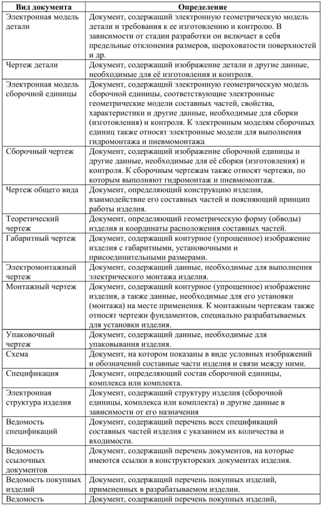
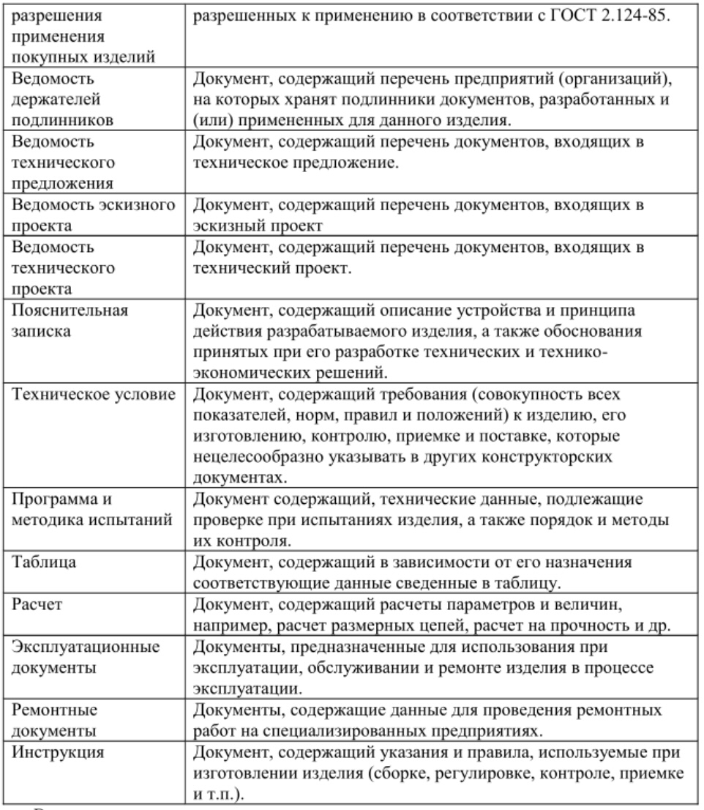
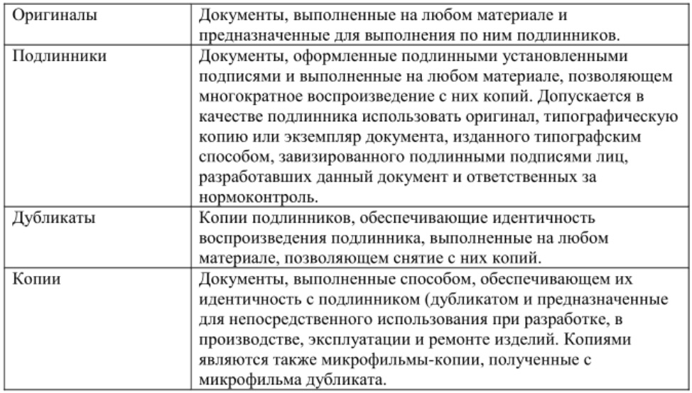
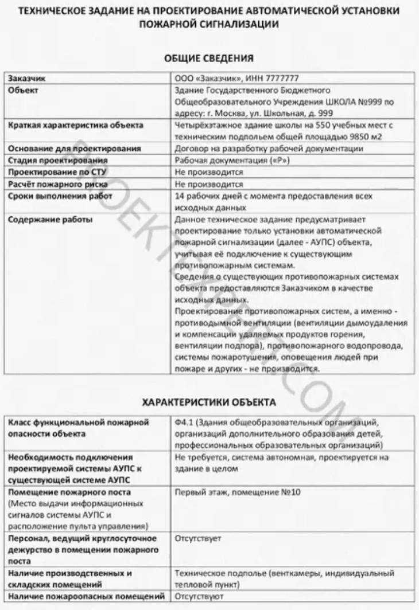
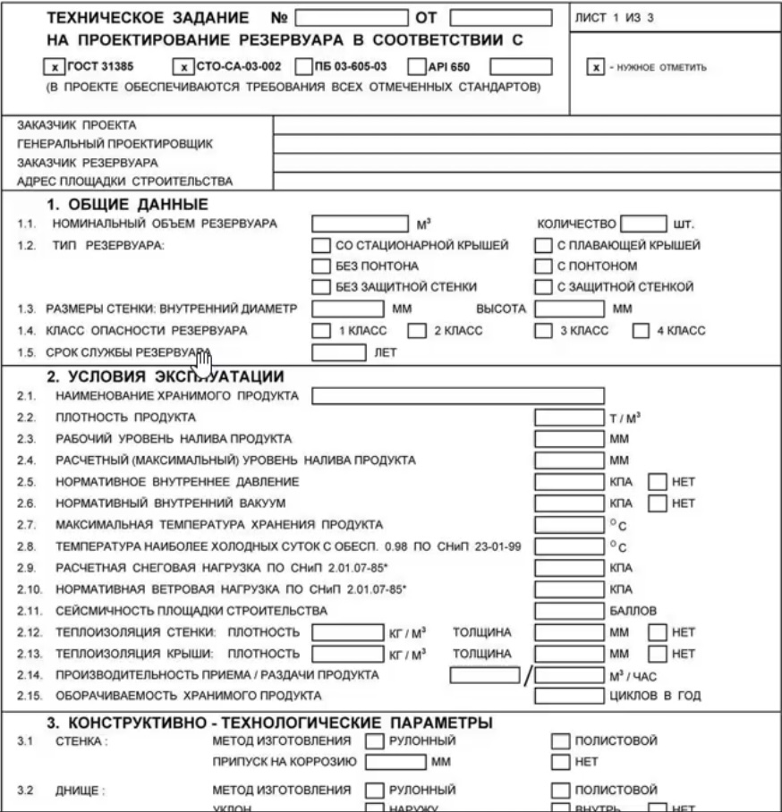
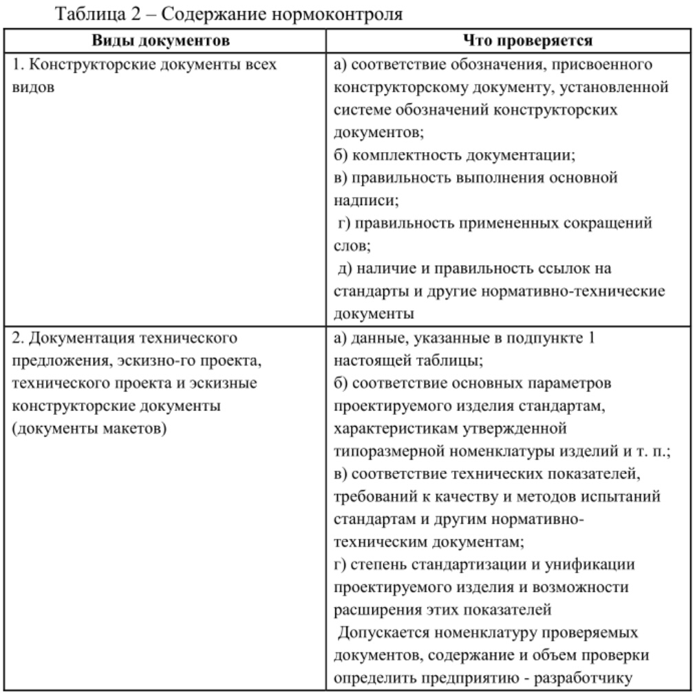
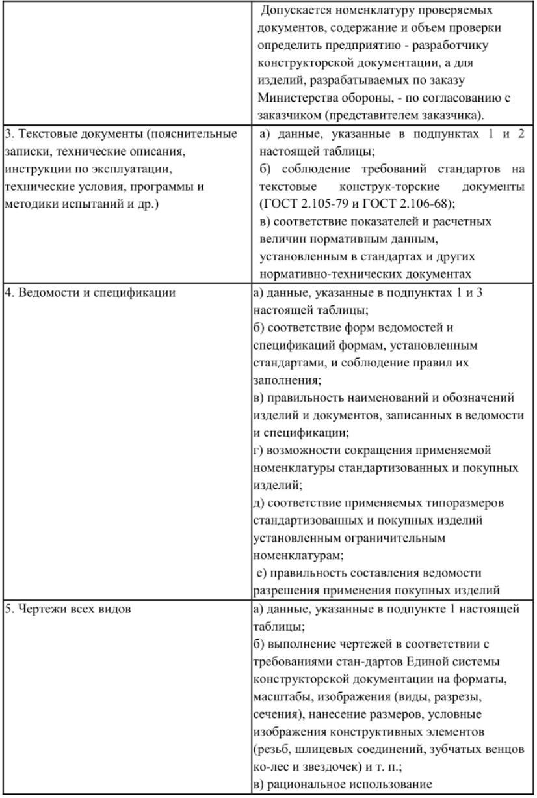
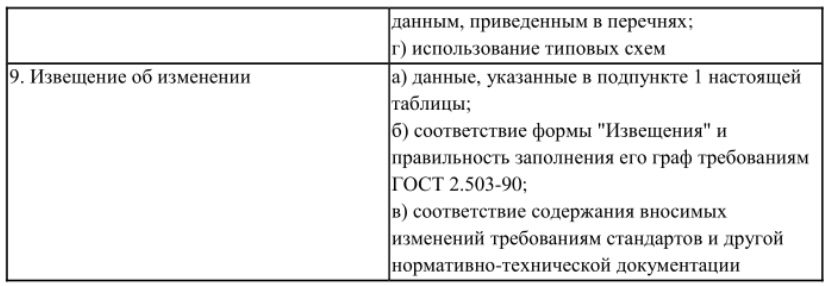
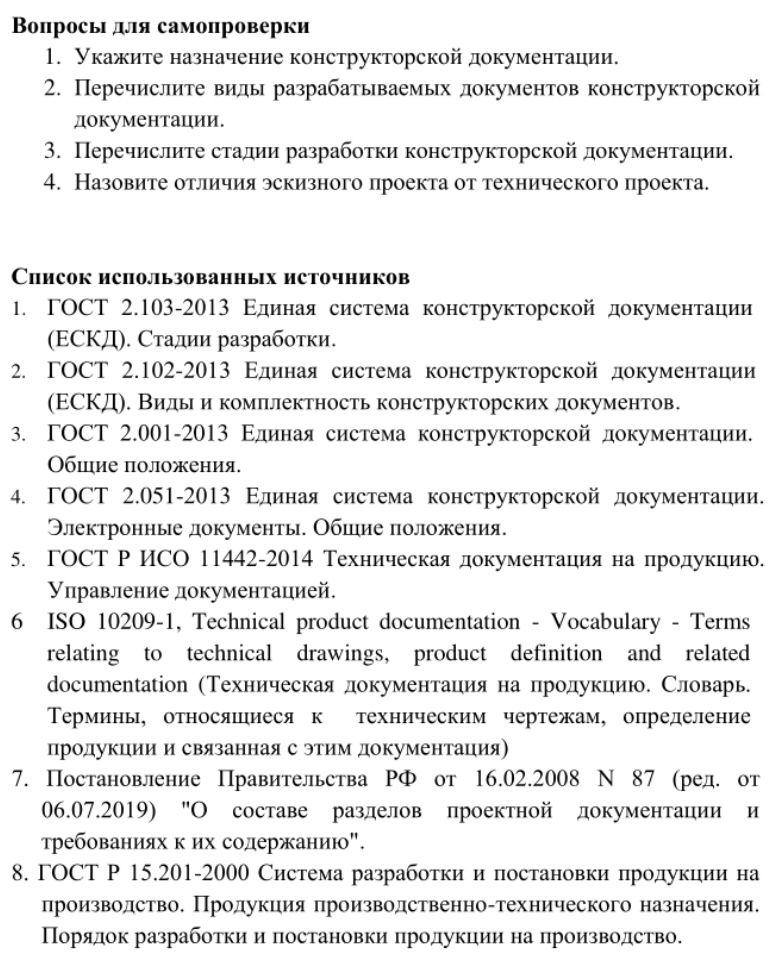

Конструкторская документация. Определение. Нормативная база.

Конструкторская документация — графические и текстовые документы, которые в отдельности или в совокупности определяют состав и устройство изделия и содержат необходимые данные для его разработки ИЛИ изготовления, контроля, приемки, эксплуатации и ремонта.

Правила разработки, оформления и обращения конструкторской документации, разрабатываемой и применяемой на всех стадиях жизненного цикла изделия, устанавливаются взаимосвязанными нормами и правилами - 

комплексом стандартов (ГОСТ) единой системы конструкторской документации ЕСКД. Стандарты ЕСКД распространяются на изделия машиностроения и приборостроения гражданского и военного назначения.

Нормы и правила по разработке, оформлению и обращению распространяются на следующую документацию:

* все виды конструкторских документов;

* учетно-регистрационную документацию для — конструкторских документов;

 - документацию по внесению изменений в конструкторские документы;

* нормативно-техническую, технологическую, программную документацию, а также научно-техническую и учебную литературу, в той части, в которой они могут быть для них применимы и не регламентируются другими стандартами и нормативами.

*Обязательность выполнения стадий и этапов разработки устанавливается техническим заданием на разработку*.

Он является базовым документом и прикладывается ко многому, i.e. договору.

Комплекс стандартов ЕСКД согласно ГОСТ 2.001-2013 «Единая система конструкторской документации. Общие положения» подразделяется на десять групп:

0 — общие положения;

1 — основные положения;

2 - классификация и обозначение изделий и конструкторских документов;

3 - общие правила выполнения чертежей;

4 — правила выполнения чертежей различных изделий;

5 — правила изменения и обращения конструкторской документации;

6 — правила выполнения эксплуатационной и ремонтной документации;

7 — правила выполнения схем;

8 -— правила выполнения документов при макетном методе проектирования;

9 — прочие стандарты. 

В соответствии с ГОСТ 2.102-2013, конструкторские документы в зависимости от способа их выполнения и характера использования подразделяются на оригиналы, дубликаты и копии (табл. 2). 

Комплектность конструкторских документов

При определении комплектности конструкторских документов на изделия следует различать:

* основной конструкторский документ;

* основной комплект конструкторских документов;

* полный комплект конструкторских документов.

Основной конструкторский документ изделия в отдельности или в совокупности с другими записанными в нем конструкторскими документами полностью и однозначно определяют данное изделие и его состав.

За основные конструкторские документы принимают:

* для деталей — чертеж детали;

* для сборочных единиц, комплексов и комплектов — спецификацию.

Основной комплект конструкторских документов — изделия объединяет конструкторские документы, относящиеся ко всему изделию (составленные на все данное изделие в целом), например, сборочный чертеж, принципиальная электрическая схема, технические условия, эксплуатационные документы.

Конструкторские документы составных частей в основной Комплект документов изделия не входят.

Полный комплект конструкторских документов изделия составляют (в общем случае) из следующих документов:

* основного комплекта конструкторских документов на данное изделие;

* основных комплектов конструкторских документов на все составные части данного изделия, примененные по своим основным конструкторским 

## Стадии разработки конструкторской документации

Конструкторские документы согласно ГОСТ 2.103-2013 «Единая система конструкторской документации (ЕСКД). Стадии разработки» в зависимости от стадии разработки подразделяются на:

- проектные, выполненные на стадиях технического предложения, эскизного и технического проектов;

- рабочие, выполненные на стадиях опытного образца (опытной партии), серийного (массового) и единичного производства и предназначенные для изготовления, эксплуатации, ремонта и утилизации изделия.

Для конструкторской документации изделий всех отраслей промышленности ГОСТ 2.103-2013 устанавливает следующие стадии разработки выполнения работ: 

## Техническое задание

Техническое задание (ТЗ) — исходный технический документ для проведения работы, устанавливающий требования к создаваемому изделию и технической документации на него, а также требования к объему, срокам проведения работы и форме представления результатов.

Согласованное и утвержденное ТЗ является неотъемлемой частью контракта (договора), заключаемого между заказчиком и исполнителем работы. ТЗ обозначается как приложение к контракту (договору).

ТЗ утверждает заказчик. Разработку и согласование ТЗ осуществляет заказчик или разработчик, исходя из статуса заказчика, источника финансирования и условий рынка сбыта.

В техническом задании учитываются интересы всех возможных потребителей.

ТЗ на ОКР может состоять из разделов, располагаемых в следующем порядке:

- наименование, шифр ОКР, основание, исполнитель и сроки выполнения ОКР;

- цель выполнения ОКР, наименование и обозначение изделия;

- технические требования к изделию;

- технико-экономические требования;

- требования к видам обеспечения;

- требования к сырью, материалам и КИМП;

- требования к консервации, упаковке и маркировке;

- специальные требования;

- требования к документации;

- этапы выполнения ОКР; 

- порядок выполнения и приемки этапов ОКР.

ТЗ на ОКР может быть дополнено приложениями.

ТЗ разрабатывается на основании ГОСТ 15.016-2016.

ТЗ содержит все сведения, необходимые для выполнения технического проекта.

**Техническое предложение**, если оно предусмотрено техническим заданием, разрабатывают с целью выявления дополнительных или уточненных требований к изделию (технических характеристик, показателей качества и др.), которые не могли быть указаны в техническом задании, и это целесообразно сделать на основе предварительной конструктивной проработки и анализа различных вариантов задания.

Техническое предложение представляет собой — совокупность конструкторских документов, которые должны содержать технические и технико-экономические — обоснования — целесообразности разработки документации изделия на основании анализа технического задания заказчика и различных вариантов возможных решений изделий, сравнительной оценки решений с учетом конструктивных и эксплуатационных особенностей разрабатываемых и существующих изделий и патентные исследования.

Правила выполнения технического предложения — по ГОСТ 2.118-2018 «ЕСКД. Техническое предложение».

В техническое предложение включают конструкторские документы, предусмотренные техническим заданием, в соответствии с ГОСТ 2.102-2013 «ЕСКД. Виды и комплектность конструкторских документов».

На рассмотрение, согласование и утверждение представляют копии документов технического предложения, скомплектованные по ГОСТ Р 2.106- 2019 «ЕСКД. Текстовые документы». 

**Эскизный проект** может оыть предусмотрен техническим заданием или протоколом рассмотрения технического предложения в тех случаях, когда конструируемое изделие не имеет аналогов и сложно по устройству. Эскизный проект разрабатывают для установления принципиальных конструктивных решений изделия, дающих общее представление о принципе его работы и (или) устройстве.

На стадии разработки эскизного проекта рассматривают варианты изделия и (или) его составных частей.

Правила выполнения эскизного проекта — по ГОСТ 2.119-2013 «ЕСКД. Эскизный проект».

Технический проект является обязательной и наиболее ответственной стадией любой опытно-конструкторской разработки. Он включает совокупность конструкторских документов, которые должны содержать 

*Посмотреть для примера данный документ в интернете и разобрать какие части в нем можно выделить…*

окончательные технические решения, дающие полное представление об устройстве разрабатываемого изделия, и исходные данные для разработки рабочей документации. На этой стадии все технические и экономические вопросы решают более подробно, уточняют расчеты всех элементов и определяют стоимость изготовления изделия. Обязательным документом технического проекта является чертеж общего вида (ВО) конструируемого изделия, а также чертежи сборочных единиц и деталей, если это вызывается необходимостью ускорения выдачи задания на разработку специализированного оборудования для изготовления.

Правила выполнения технического проекта — по ГОСТ 2.120-2013 «ЕСКД. Технический проект».

Чертеж общего вида технического проекта в общем случае должен содержать: изображения изделия (виды, разрезы, сечения), текстовую часть и надписи, необходимые для понимания конструктивного устройства изделия, взаимодействия его составных частей и принципа работы изделия.

После утверждения технического проекта разрабатывается рабочая документация, необходимая для изготовления опытного и серийного изделия: чертежи деталей, сборочные чертежи изделия и отдельных его сборочных единиц, пояснительная записка и спецификации.

Рабочие чертежи выполняются, как правило заводами-изготовителями химической аппаратуры применительно к своему оборудованию, оснастке и нормалям на отдельные сборочные единицы и детали.

**Нормоконтроль** (ГОСТ 3.1116-2011). Нормоконтроль является завершающим этапом разработки конструкторской документации. В соответствии с этим передачу подлинников документов отделу технической документации или заменяющему его подразделению рекомендуется поручать нормоконтролеру.

Проведение нормоконтроля должно быть направлено на:

а) соблюдение в разрабатываемых изделиях норм и требований, установленных в государственных, отраслевых, республиканских стандартах и стандартах предприятий;

б) правильность выполнения конструкторских документов в соответствии с требованиями стандартов ЕСКД;

в) достижение в разрабатываемых изделиях высокого уровня стандартизации и унификации на основе широкого использования ранее 

Нормоконтролю подлежит Техническая документация на изделия основного и вспомогательного производства независимо от подчиненности и служебных функций подразделений, выпустивших указанную документацию.

Примерное содержание нормоконтроля в зависимости от вида документов, составляемых на всех стадиях разработки, приведено в табл. 2. 

спроектированных, освоенных в производстве и стандартизованных изделий, типовых конструкторских решений и исполнений;

г) рациональное использование установленных ограничительных номенклатур стандартизованных изделий, конструктивных норм (резьб, диаметров, шлицевых соединений, модулей зубчатых колес, допусков и посадок, конусностей и других элементов деталей машин), марок материалов, профилей и размеров проката ит. п.

Нормоконтролю подлежит Техническая документация на изделия основного и вспомогательного производства независимо от подчиненности и служебных функций подразделений, выпустивших указанную документацию.

Примерное содержание нормоконтроля в зависимости от вида документов, составляемых на всех стадиях разработки, приведено в табл. 2. 

### Порядок проведения нормоконтроля. Нормоконтроль рекомендуется проводить в два этапа:

Т этап - проверка оригиналов конструкторских документов перед передачей на изготовление подлинников и размножение. Эти материалы предъявляют нормоконтролеру с подписями в графах "Разраб." и "Пров.";

П этап - проверка конструкторских документов в подлинниках при наличии всех подписей лиц, ответственных за содержание и выполнение конструкторских документов, кроме утверждающей подписи руководителя организации или предприятия.

Конструкторские документы должны, как правило, предъявляться на нормоконтроль комплектно:

для проектной документации (технического предложения, эскизного и технического проектов) - все документы, разрабатываемые на соответствующей стадии;

для рабочей документации - документация на сборочную единицу (чертежи деталей, сборочные чертежи, спецификации и пр.);

Подписание — нормоконтролером проверенных — конструкторских документов производится следующим образом:

а) если документ проверяет один нормоконтролер по всем показателям, он подпи-сывает его в месте, отведенном для подписи нормоконтролера;

б) если документ последовательно проверяют — несколько специализированных нормоконтролеров, то подписание этих документов в месте, отведенном для подписи нормоконтролера, производится исполнителем наиболее высокой (в группе нормоконтролеров) должностной категории. Остальные нормоконтролеры после проверки документа ставят свои визы на полях;

в) документацию, утверждаемую руководителем организации или предприятия, нормоконтролер визирует до передачи на утверждение и подписывает в установленном месте после утверждения.

Исправлять и изменять подписанные нормоконтролером, но не сданные в отдел (бюро) технической документации подлинники документов, без его ведома не допускается. 

